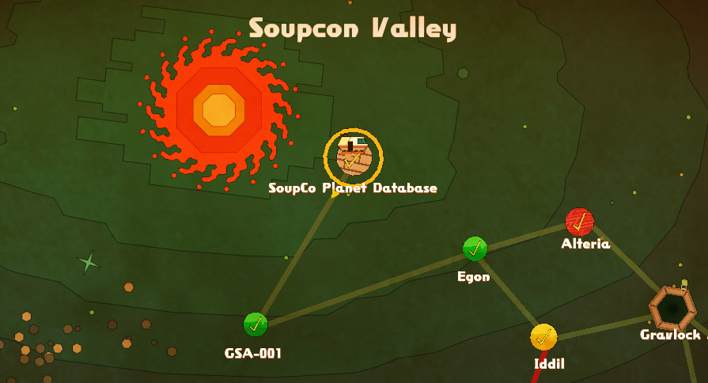

# Nom Nom Galaxy Custom Map Creator v0.9
A web-based tool to create custom maps for the video game [Nom Nom Galaxy](https://steamcommunity.com/app/226100/discussions/0/135514649162625055/) from PixelJunk™    
## You can use this tool online in your browser, simply **[>click here<](https://anotherindex.github.io/Nom-Nom-Galaxy-Custom-Map-Creator/index.html)**

*This tool is just a fun little vibe coded project I made in my spare time, please treat it as such. I am in no way associated with PixelJunk or any of the Nom Nom Galaxy creators or developers.*

# Guide/Tutorial

## I. How to use this map creator

- Use **New Map** (top left) to create a new blank map, or **Load Map** to load a previously created one.
- Use the Tools and Elements to place things on the map or edit it.
- Hotkeys are simple and highly recommended:
- Pen (A), Line (S), Rectangle (D), Circle (F), Fill bucket (G), Select (H), Hand/Pan (J)
- Number keys **1-9** and **0** jump straight to elements 1-10.
- **Q** / **E** step to the previous / next element, wrapping around at both ends.
- *Right-click* with any drawing tool erases instead of painting.
- Hold *Space* and drag to pan the canvas from any tool.
- Mouse wheel scrolls to zoom in and out.
- Use **Map Gallery** (top right) to browse a small gallery of example maps, load one straight into the editor to see how it's built, or download its .png as a starting point.
- Use **Change Map Size** (top right) to grow, shrink, or crop the canvas from any edge without starting over.

The **Select tool (H)** is a powerful tool that lets you copy, cut, and paste areas of the map:

1. Pick the tool, then select an area on the map.
2. Press Ctrl+C to copy, or Ctrl+X to cut the selected area.
3. Hover your mouse over the top-left corner of where you want to paste.
4. Press Ctrl+V - a preview of the pasted selection appears. Left-click to place it; hover elsewhere and press Ctrl+V again to reposition; press Esc to cancel.

You can paste the same copied/cut area multiple times, a bit like a stamp.

## II. How to export and play a custom map

*(If you are using a Chromium-based browser like Chrome or Edge you can try enabling the "Advanced Map Export" in the Settings, but note that it is an experimental feature. It makes exporting maps less tedious. A detailed tutorial can be found below the default one.)*

1. Once your map is ready, make sure you've placed a Spawn point, then click **Export Map** (top left). This downloads a .png file.
2. Navigate to your Nom Nom Galaxy folder, usually in your Steam directory: `steamapps\common\NomNomGalaxy\custom_planets`. The easiest way there is to right-click Nom Nom Galaxy in your Steam library, select "Manage", then "Browse Local Files".
3. Open the `custom_planets` folder and create a new folder with the name you want for your map, e.g. "My New Map". Place the downloaded .png inside and rename it to your folder's name with `_map.png` at the end.

Examples:
- `NomNomGalaxy\custom_planets\Squidfly Planet 04\Squidfly Planet 04_map.png`
- `NomNomGalaxy\custom_planets\test_planet_461\test_planet_461_map.png`
- `NomNomGalaxy\custom_planets\Hello World\Hello World_map.png`

Launch Nom Nom Galaxy, go to **Corporate Conquest** (the main story mode), and navigate to **SoupCo Planet Database**, located near the very beginning. From there you should be able to select your map.

*Note: you can add new folders and maps while the game is running, no restart needed. You cannot, however, edit any folders or maps the game has already detected and loaded during that session.*

### Advanced Map Export (optional)
Advanced Map Export allows you to create the folder and map data more easily without the hassle of manually creating/renaming files.    
If you are using a Chromium-based browser like Google Chrome or Microsoft Edge you can enable the "Advanced Map Export" feature in the Settings. The Setting button can be found next to the "Load Map" button.    
If enabled, the "Export Map" button will now ask you for the location of your Nom Nom Galaxy "custom_planets" folder.    
(The easiest way to find the location of this folder is to right-click Nom Nom Galaxy in your Steam library, select "Manage", then "Browse Local Files".)    
Once you selected your "custom_planets" folder during export, the browser will prompt you whether you want to allow the page to edit files on your computer. This is generally a prompt you should not accept, but if you made it this far I think you know what you're doing. If you accept it, the Custom Map Creator will have created a folder and map file ready to be loaded from inside Nom Nom Galaxy.   

The tool remembers which folder you picked, so the next time you export you normally won't have to browse to it again - you'll just get a quick "allow access" confirmation (this can reset if you restart your browser, clear site data, or switch machines, in which case you'll be asked to browse to the folder once more).

## III. Tips, tricks and more

- Don't fully block the sky with stone - the spaceship has to land somewhere, and you need to be able to shoot rockets to ship soup.
- Chickenberry Trees need at least one block directly beneath them, otherwise the map will not load!
- The planet's background and foreground colors are currently randomized, so try changing a pixel if you aren't happy with the result - one small change may do the trick.
- Make sure the bottom layer of your planet is filled in. Floating islands are possible, but you'll still need sturdy ground somewhere.
- Be reasonable with map size and the amount of monster spawns you place - the game might crash under extreme conditions.

## IV. FAQ and troubleshooting

**My map doesn't show up in the game.**
Make sure you named the folder and .png file correctly, as described in step 3 above. Don't use special characters in map or folder names, except for underscores `_`, dashes `-`, and the pound symbol `#`.

**My game crashes the moment I try to launch a custom map.**
The most common reason is a Chickenberry Tree (the teal apple-looking tree) missing a block directly below its trunk. If it still crashes, check for things placed too close together or areas that are too densely populated. You can also ask for help on the Nom Nom Galaxy Discord (The Discord invite code is `NgzyprT`) or the [Q-Games Ltd. Discord](https://discord.com/invite/qgamesforever) (in the #classic-q-games channel).

**Can I build with more than the 19 selectable elements?**
No - things like single mushrooms, Kabochasers (the pumpkins), Stabgrass, and more can't be placed manually. They may generate automatically and randomly across the map.

**Can I play against an enemy soup company?**
Not currently. These maps can only be played as S.O.O.P. Simulations - essentially free-play, where the goal is whatever you set for yourself. Try challenging yourself to something like earning 5000 gold within a set number of days, or defeating every enemy without dying once.

**I found a bug with the Map Creator, what should I do?**
Report it on this very GitHub page, or send a message on Discord to **@anotherindex** (Index) - usually reachable on the Nom Nom Galaxy Discord or the Q-Games Ltd. Discord (in the #classic-q-games channel).

